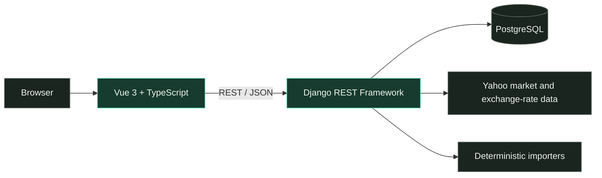

<div align="center">


<h1>Finanzr</h1>

<p>A self-hosted dashboard for tracking savings, investments and net worth.</p>

<p>
  <a href="docs/roadmap.md"></a>
  <a href="LICENSE"></a>
  <a href="frontend/"></a>
  <a href="backend/"></a>
  <a href="compose.yaml"></a>
  <a href="compose.yaml"></a>
  <a href="backend/locale/"></a>
</p>

<p>
  <a href="#quick-start">Quick start</a> ·
  <a href="#what-you-can-track">Features</a> ·
  <a href="#supported-languages">Languages</a> ·
  <a href="#supported-importers">Importers</a> ·
  <a href="#architecture">Architecture</a> ·
  <a href="SECURITY.md">Security</a> ·
  <a href="CONTRIBUTING.md">Contributing</a>
</p>

</div>

> [!NOTE]
> Finanzr is alpha software under active development. Always verify financial,
> tax and investment figures against the original statements.

## Overview

Finanzr runs on infrastructure you control and keeps data separated into
workspaces. It supports cookie sessions, CSRF protection and `owner`, `editor`
and `viewer` roles. Accounts, balances, holdings and transactions can be
managed from the interface. Supported broker and exchange statements can also
be imported into fund, stock and crypto accounts.

## See it in action

Every screen below was captured in English from a demo workspace created with
`seed_demo_data`. All names, holdings and values are synthetic.

<table>
  <tr>
    <td width="50%" align="center">
      <br>
      <sub><strong>Overview</strong> · Net worth, trajectory and allocation</sub>
    </td>
    <td width="50%" align="center">
      <br>
      <sub><strong>Portfolio</strong> · Composition and concentration</sub>
    </td>
  </tr>
  <tr>
    <td width="50%" align="center">
      <br>
      <sub><strong>Funds</strong> · Positions, prices and performance</sub>
    </td>
    <td width="50%" align="center">
      <br>
      <sub><strong>Stocks & ETFs</strong> · P&L and market value</sub>
    </td>
  </tr>
  <tr>
    <td colspan="2" align="center">
      <br>
      <sub><strong>Crypto</strong> · Accounts, positions and performance</sub>
    </td>
  </tr>
</table>

## What you can track

| Area        | Highlights                                                             |
| ----------- | ---------------------------------------------------------------------- |
| Savings     | Account balances, monthly history and consolidated totals              |
| Investments | Monthly balances, contributions, value history and P&L                 |
| Funds       | Positions, orders, prices, statement imports and performance charts    |
| Stocks      | Positions, realized and unrealized P&L, price history and conversion   |
| Crypto      | Accounts, trades, positions and supported KrakenPro imports            |
| Real estate | Capital deployed, cash flows, repayments and withholding               |
| Portfolio   | Holdings grouped by asset, class, account, platform or source           |

Synthetic demo records are available through `seed_demo_data`. The example
files in [`examples/imports/`](examples/imports/) are fictional contract
fixtures, not anonymized customer exports.

## Supported languages

| Language | Locale  | Notes                        |
| -------- | ------- | ---------------------------- |
| Spanish  | `es-ES` | Default interface language   |
| English  | `en`    | Source language and fallback |

Spanish and English are the languages currently supported across the web
interface and backend messages. Contributions for additional languages are
welcome. A new translation should cover both the Vue catalogs in
[`frontend/src/i18n/`](frontend/src/i18n/) and the Django translations in
[`backend/locale/`](backend/locale/). See the
[language and i18n contribution guidelines](CONTRIBUTING.md#language-and-i18n)
before starting a translation.

## Supported importers

| Platform or source          | Data imported                                  | Format and limits                                                                                  |
| --------------------------- | ---------------------------------------------- | -------------------------------------------------------------------------------------------------- |
| MyInvestor through Inversis | Fund subscriptions, redemptions and transfers | 11-column CSV, HTML or Inversis HTML with an `.xls` extension; binary Excel is not supported       |
| Trade Republic              | Stock and ETF transactions                    | UTF-8, comma-separated CSV with the original export header                                         |
| KrakenPro                   | Spot trades                                   | UTF-8 CSV; EUR-quoted pairs only; the importer has not been validated against classic Kraken files |

Manual account management remains available for platforms without an importer.
The importer registry is intended to grow as contributors add support for other
banks, brokers and exchanges. Importers are deterministic parsers with
synthetic fixtures and focused tests; they do not write directly to the
database. See [`docs/create-importer.md`](docs/create-importer.md) for the
contract, registration steps and test requirements.

## Quick start

You need Docker Engine with the Compose plugin.

### 1. Start the application

```bash
cp .env.example .env
docker compose up --build -d
docker compose exec backend python manage.py migrate
```

This starts Finanzr without creating a user or loading financial data. Choose
one of the account setup options below before signing in.

### 2. Create an administrator account

Use `bootstrap_owner` for a normal local installation. It creates an
application administrator, an empty workspace and an `owner` membership in
that workspace. It does not load demo data.

The following shell commands read the password without displaying it and pass
it to Django through standard input:

```bash
printf 'Owner password: '
FINANZR_TTY_STATE=$(stty -g)
trap 'stty "$FINANZR_TTY_STATE"' EXIT HUP INT TERM
stty -echo
IFS= read -r FINANZR_LOCAL_OWNER_PASSWORD
stty "$FINANZR_TTY_STATE"
trap - EXIT HUP INT TERM
printf '\n'
printf '%s\n' "$FINANZR_LOCAL_OWNER_PASSWORD" | docker compose exec -T backend \
  python manage.py bootstrap_owner \
  --email owner@example.test \
  --password-stdin \
  --workspace home \
  --workspace-name 'My workspace'
unset FINANZR_LOCAL_OWNER_PASSWORD
```

Replace the email and workspace name with your own values. This account has the
Finanzr `admin` role; it is not a Django superuser. Open
**<http://localhost:5173/app/>** and sign in with the owner email and password.

### Optional: load the demo account

To explore Finanzr with synthetic accounts, transactions and holdings, load the
demo workspace after starting the application:

```bash
docker compose exec backend python manage.py seed_demo_data
```

Sign in at **<http://localhost:5173/app/>** with:

- Email: `demo@finanzr.local`
- Password: `finanzr-demo-local`

The demo account is read-only. Its default identifiers are the
`demo@finanzr.local` email and the workspace slug `demo`. Each run resets that
account to the demo role and password and rebuilds that workspace. Do not reuse
an existing account email with the `--email` option or use `demo` as the slug of
a normal workspace. With distinct identifiers, the demo and administrator
workspaces can coexist. See [`docs/demo.md`](docs/demo.md) for the generated data
and reset behavior.

| Service         | Local URL                           |
| --------------- | ----------------------------------- |
| Web application | <http://localhost:5173/app/>        |
| API             | <http://localhost:8000/api/>        |
| Health check    | <http://localhost:8000/api/health/> |

The development stack uses bind mounts and a local PostgreSQL volume. Stop it
with `docker compose down`; add `-v` only when you intentionally want to delete
that local database volume.

## Architecture



- `frontend/` contains the Vue application, charts, API client and i18n catalogs.
- `backend/` contains the API, authentication, workspaces and persistence.
- `finanzr/domain/` contains framework-independent financial rules.
- `finanzr/importers/` contains deterministic import contracts and parsers.

Read [`docs/architecture.md`](docs/architecture.md) for ownership boundaries and
[`docs/data-model.md`](docs/data-model.md) for the data model.

## Self-hosting

The production configuration builds read-only Gunicorn and Caddy application
containers, stores PostgreSQL data in a named volume and defines container
health checks. Operators remain responsible for the host, firewall, HTTPS,
DNS, secrets and off-host backups.

The deployment scripts use `/opt/finanzr` by default. Place the checkout there
or pass its absolute path through `FINANZR_PROJECT_DIR`.

1. Copy `.env.production.example` to `.env.production` in the checkout.
2. Replace every placeholder with installation-specific values.
3. Keep secrets outside version control and arrange off-host copies of encrypted
   backups.
4. Run the installer with the first owner email and workspace name:

```bash
sudo env FINANZR_PROJECT_DIR='/absolute/path/to/finanzr' \
  FINANZR_OWNER_EMAIL='owner@example.test' \
  FINANZR_WORKSPACE_NAME='My household' \
  ./deploy/install.sh
```

The installer requests the owner password without echoing it. For an unattended
installation, use `FINANZR_OWNER_PASSWORD_FILE` with a mode-`600` file. Never
put the password in a command line or shell history.

Without LAN mode, the web container does not publish a host port; connect it to
a separately configured HTTPS ingress or tunnel. The repository includes an
optional Cloudflare Tunnel service, but the installer does not enable or
configure it automatically.

For HTTP access on a trusted network, add `FINANZR_LAN=1` when running the
installer and set `LAN_BIND_ADDRESS` in `.env.production`. Its default is
`127.0.0.1`, so it is not reachable from other machines until explicitly
changed. LAN mode disables HTTPS redirects and secure-cookie flags and must not
be exposed to an untrusted network.

<details>
<summary><strong>Updates, backups and rollback</strong></summary>

After checking out the source revision you intend to run, deploy that checkout
with:

```bash
sudo env FINANZR_PROJECT_DIR='/absolute/path/to/finanzr' ./deploy/deploy.sh
```

The script does not fetch or select a release. It creates an encrypted database
backup, builds the current checkout, applies migrations, runs Django deployment
checks and restarts the application containers. Record the previous source
revision and image digests before updating. If a migration is not reversible,
rollback requires the matching previous source or images and a compatible
pre-upgrade backup.

See [`docs/security.md`](docs/security.md) for backup, restoration and
deployment procedures.

</details>

## Privacy and security

- `.gitignore` covers local environment files, common database files, CSV/XLSX
  statements and the `data/`, `backups/` and `secrets/` directories. Keep other
  exports outside the checkout.
- Workspace boundaries are enforced by the API and covered by isolation tests.
- Login uses cookie sessions and CSRF protection.
- Database backups are encrypted with `EXTERNAL_CREDENTIALS_KEY`; restoration
  requires the same externally supplied key.
- Production defaults expect HTTPS; LAN mode is explicit and opt-in.
- Security reports follow the private process in [`SECURITY.md`](SECURITY.md).

Import only copies of statements you own, review the reported imported and
skipped rows, and keep the originals outside the repository. Market prices can
be unavailable or delayed, and currency or tax results must be checked against
primary records.

## Project status

Finanzr is alpha software under active development. Work required before the
first versioned release is tracked in [`docs/roadmap.md`](docs/roadmap.md).
Architecture decisions live in [`docs/adr/`](docs/adr/).

Contributions are welcome, including new importers and translations. Start with
[`CONTRIBUTING.md`](CONTRIBUTING.md) and review the support boundaries in
[`SUPPORT.md`](SUPPORT.md).

## License and disclaimer

Finanzr is licensed under the
[GNU Affero General Public License v3.0](LICENSE).

Finanzr records and visualizes information. It is not a financial adviser,
broker, accountant, tax professional or source of investment recommendations.
No price, return, allocation or tax output is guaranteed. You are responsible
for validating your data and complying with applicable law.

The AGPL does not grant rights to the project name or visual identity.
Screenshots and videos must use synthetic data. Asset and dependency provenance
is documented in
[`docs/licensing.md`](docs/licensing.md).
