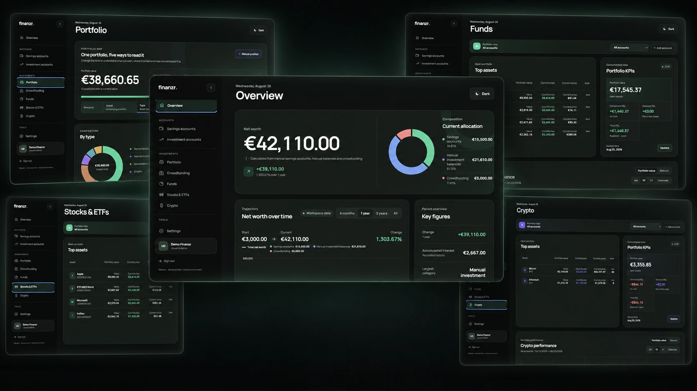
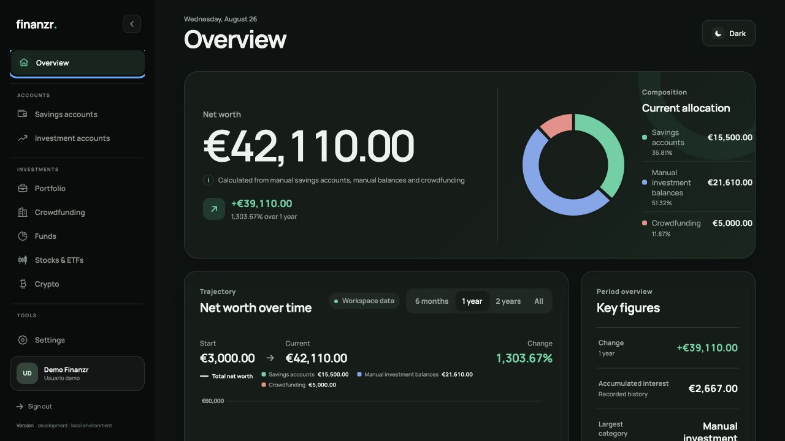
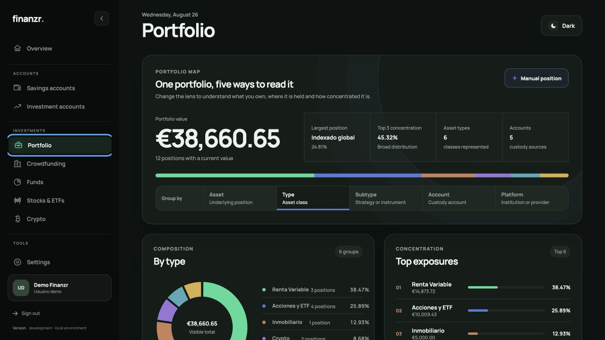
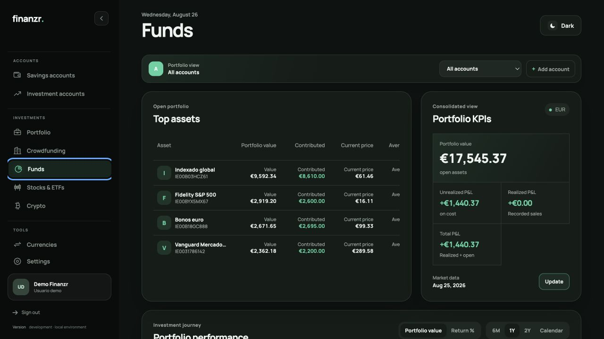
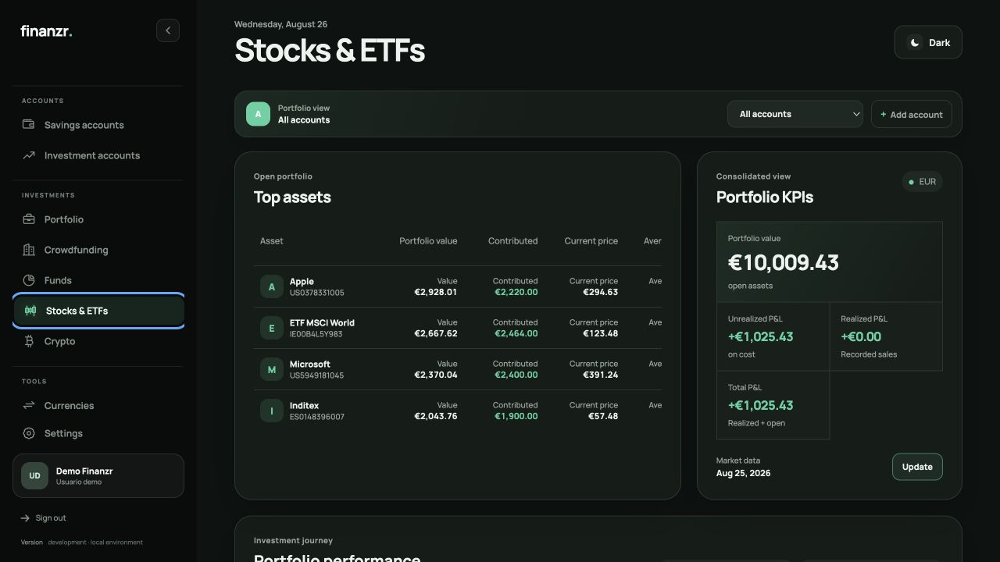
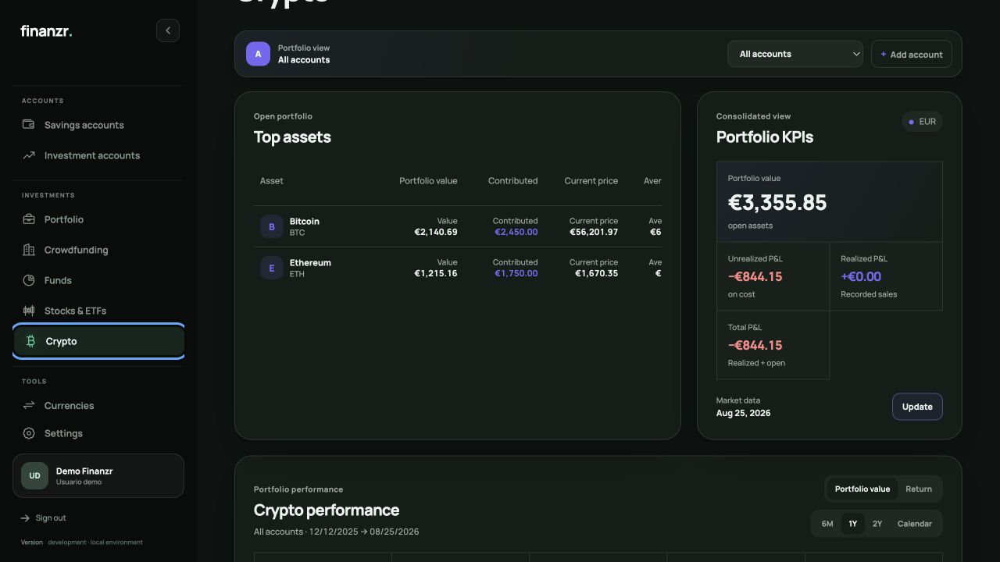
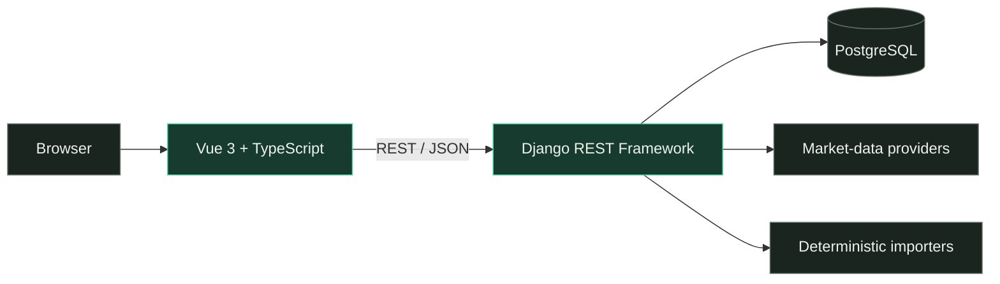

<div align="center">



<h1>Finanzr</h1>

<h3>Your finances. Your server. Your data.</h3>

<p>A modern, self-hosted dashboard for understanding savings, investments and<br>net worth in one private workspace.</p>

<p>
  <a href="docs/roadmap.md"></a>
  <a href="LICENSE"></a>
  <a href="frontend/"></a>
  <a href="backend/"></a>
  <a href="compose.yaml"></a>
  <a href="compose.yaml"></a>
  <a href="backend/locale/"></a>
</p>

<p>
  <a href="#quick-start">Quick start</a> ·
  <a href="#what-you-can-track">Features</a> ·
  <a href="#architecture">Architecture</a> ·
  <a href="SECURITY.md">Security</a> ·
  <a href="CONTRIBUTING.md">Contributing</a>
</p>

</div>

> [!NOTE]
> Finanzr is alpha software under active development. Always verify financial,
> tax and investment figures against the original statements.

## One place for the complete picture

Finanzr brings accounts and assets into a calm, consistent dashboard without
handing your financial history to a hosted analytics service.

|                               |                                                                                                                      |
| ----------------------------- | -------------------------------------------------------------------------------------------------------------------- |
| **Private by design**         | Run it on infrastructure you control, with encrypted backups and no operational dataset included in the source tree. |
| **A unified net worth**       | Explore savings, funds, stocks, crypto, real estate and manually managed assets from one workspace.                  |
| **Built for real statements** | Import supported broker and exchange exports with deterministic parsers, previews and duplicate protection.          |
| **Small-team ready**          | Cookie sessions, CSRF protection, isolated workspaces and `owner`, `editor` and `viewer` roles.                      |
| **Bilingual**                 | Spanish and English interfaces, with an installation default and per-user preference.                                |
| **Inspectable**               | Open source, documented architecture, explicit API schema and reproducible checks.                                   |

## See it in action

Every screen below comes from an isolated English-language demo workspace
created with `seed_demo_data`. All names, holdings and values are synthetic.

<table>
  <tr>
    <td width="50%" align="center">
      <br>
      <sub><strong>Overview</strong> · Net worth, trajectory and allocation</sub>
    </td>
    <td width="50%" align="center">
      <br>
      <sub><strong>Portfolio</strong> · Composition and concentration</sub>
    </td>
  </tr>
  <tr>
    <td width="50%" align="center">
      <br>
      <sub><strong>Funds</strong> · Positions, prices and performance</sub>
    </td>
    <td width="50%" align="center">
      <br>
      <sub><strong>Stocks & ETFs</strong> · P&L and market value</sub>
    </td>
  </tr>
  <tr>
    <td colspan="2" align="center">
      <br>
      <sub><strong>Crypto</strong> · Accounts, positions and performance</sub>
    </td>
  </tr>
</table>

## What you can track

| Area        | Highlights                                                             |
| ----------- | ---------------------------------------------------------------------- |
| Savings     | Account balances, monthly history and consolidated totals              |
| Investments | Contributions, value history and period performance                    |
| Index funds | Positions, orders, prices, account imports and performance charts      |
| Stocks      | Positions, realized and unrealized P&L, splits and currency conversion |
| Crypto      | Accounts, trades, positions and supported KrakenPro imports            |
| Real estate | Capital deployed, cash flows, repayments and withholding               |
| Portfolio   | Allocation across financial and manually managed assets                |
| Planning    | Budgets and target-allocation calculations                             |

Synthetic demo records are available through `seed_demo_data`. The example
files in [`examples/imports/`](examples/imports/) are fictional contract
fixtures, not anonymized customer exports.

## Quick start

You need Docker Engine with the Compose plugin.

```bash
cp .env.example .env
docker compose up --build -d
docker compose exec backend python manage.py migrate
docker compose exec backend python manage.py seed_demo_data \
  --email demo@example.test --password 'choose-a-local-demo-password'
```

Open **<http://localhost:5173/>** and sign in with the demo credentials.

| Service         | Local URL                           |
| --------------- | ----------------------------------- |
| Web application | <http://localhost:5173/>            |
| API             | <http://localhost:8000/api/>        |
| Health check    | <http://localhost:8000/api/health/> |

The development stack uses bind mounts and a local PostgreSQL volume. Stop it
with `docker compose down`; add `-v` only when you intentionally want to delete
that local database volume.

For demo lifecycle and reset options, see [`docs/demo.md`](docs/demo.md).

## Architecture



- `frontend/` contains the Vue application, charts, API client and i18n catalogs.
- `backend/` contains the API, authentication, workspaces and persistence.
- `finanzr/domain/` contains framework-independent financial rules.
- `finanzr/importers/` contains deterministic import contracts and parsers.

Read [`docs/architecture.md`](docs/architecture.md) for ownership boundaries and
[`docs/data-model.md`](docs/data-model.md) for the data model.

## Self-hosting

The production configuration provides immutable application containers,
PostgreSQL persistence, health checks, secure Django defaults and an optional
trusted-LAN overlay.

1. Copy `.env.production.example` to `.env.production`.
2. Replace every placeholder with installation-specific values.
3. Keep secrets outside version control.
4. Run the installer with the first owner email:

```bash
sudo env FINANZR_OWNER_EMAIL='owner@example.test' \
  FINANZR_WORKSPACE_NAME='My household' \
  ./deploy/install.sh
```

The installer requests the owner password without echoing it. For an unattended
installation, use `FINANZR_OWNER_PASSWORD_FILE` with a mode-`600` file. Never
put the password in a command line or shell history.

For a trusted private LAN, add `FINANZR_LAN=1`; otherwise place the application
behind a maintained HTTPS reverse proxy or tunnel. The Compose files alone do
not make a server safe to expose to the Internet.

<details>
<summary><strong>Updates, backups and rollback</strong></summary>

The official updater creates an encrypted backup, builds images, applies
migrations, runs deployment checks and restarts services while preserving the
selected deployment mode:

```bash
sudo env FINANZR_VERSION='release-version' ./deploy/deploy.sh
```

Record the current version and image digests before updating. Test restoration
against an isolated database. If a release includes an incompatible migration,
restore its pre-upgrade encrypted backup into an empty database and run the
matching previous images instead of guessing at a reverse migration.

See [`docs/security.md`](docs/security.md) for backup, restoration and
deployment procedures.

</details>

## Privacy and security

- Operational exports, databases, credentials and backups are ignored by Git.
- Workspace boundaries are enforced by the API and covered by isolation tests.
- Login uses cookie sessions and CSRF protection.
- External credentials and application backups use a separately managed Fernet
  key.
- Production defaults expect HTTPS; LAN mode is explicit and opt-in.
- Security reports follow the private process in [`SECURITY.md`](SECURITY.md).

Import only copies of statements you own, review previews carefully and keep
the originals outside the repository. Market prices can be unavailable or
delayed, and currency or tax results must be checked against primary records.

## Project status

Finanzr is preparing its first public alpha. Remaining product and release work
is tracked in [`docs/roadmap.md`](docs/roadmap.md). Material architecture
decisions live in [`docs/adr/`](docs/adr/).

Want to help? Start with [`CONTRIBUTING.md`](CONTRIBUTING.md), review the support
boundaries in [`SUPPORT.md`](SUPPORT.md), and keep user-facing Spanish and
English catalogs aligned. Translation into other languages will also be appreciated.

## License and disclaimer

Finanzr is licensed under the
[GNU Affero General Public License v3.0](LICENSE).

Finanzr records and visualizes information. It is not a financial adviser,
broker, accountant, tax professional or source of investment recommendations.
No price, return, allocation or tax output is guaranteed. You are responsible
for validating your data and complying with applicable law.

The name and project visual identity are project marks and are not granted as
trademarks by the AGPL. Screenshots and videos must use synthetic data. Asset
and dependency provenance is documented in
[`docs/licensing.md`](docs/licensing.md).
