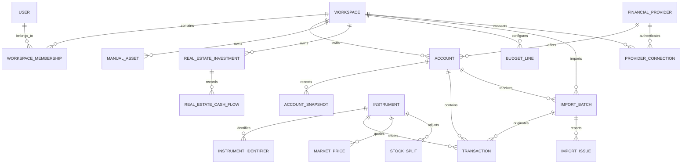

# Finanzr Relational Data Model

## Status

Implemented in Django/PostgreSQL. Django migrations are the executable schema
contract; this document explains the intended relationships, constraints, and
ownership rules.

When this logical description and the current models differ, update the
documentation or record the intentional difference in an ADR instead of
treating this document as a pending implementation proposal.

## Principles

1. Every private datum belongs to a `Workspace`, directly or through an account.
2. A user may participate in multiple workspaces.
3. Accounts and transactions use shared models instead of one table per provider or asset.
4. Financial instruments are global; positions and operations are private.
5. The portfolio is a calculated projection, not a second copy of the assets.
6. Money, quantities, and percentages use `Decimal`, never `float`.
7. Imports are traceable, repeatable, and idempotent.
8. Financial histories are archived; they are not cascade-deleted during ordinary operations.
9. Credentials and tokens are never stored in plaintext.

## High-Level Diagram



## Identity and Multi-Tenancy

### `User`

A custom Django model from the first migration.

| Field | Type | Rules |
|---|---|---|
| `id` | UUID | PK |
| `email` | normalized email | unique, case-insensitive |
| `password` | Django hash | never plaintext |
| `display_name` | varchar(120) | optional |
| `is_active` | boolean | default `true` |
| `is_staff` | boolean | technical administration |
| `created_at` | timestamptz | automatic |
| `updated_at` | timestamptz | automatic |

Email is the login identifier. The standard `User` model is not used in order
to avoid a complex later migration.

### `Workspace`

Ownership and isolation unit.

| Field | Type | Rules |
|---|---|---|
| `id` | UUID | PK |
| `name` | varchar(120) | required |
| `slug` | varchar(80) | unique per installation |
| `base_currency` | char(3) | initially `EUR` |
| `timezone` | varchar(64) | initially `Europe/Madrid` |
| `created_at` | timestamptz | automatic |
| `archived_at` | timestamptz nullable | logical archive |

`base_currency` is the workspace reporting currency. Once operations, snapshots,
manual assets, real estate, or a budget exist, it cannot be changed directly:
doing so would mix historical amounts expressed in different bases. A future
change requires an explicit, transactional rebase process.

### `WorkspaceMembership`

| Field | Type | Rules |
|---|---|---|
| `id` | UUID | PK |
| `workspace_id` | FK Workspace | CASCADE when deleting workspace |
| `user_id` | FK User | CASCADE when deleting user |
| `role` | enum | `owner`, `editor`, `viewer` |
| `created_at` | timestamptz | automatic |

Constraints:

- Unique `(workspace_id, user_id)`.
- Every active workspace must retain at least one `owner`; this rule is applied in the service/transaction layer.
- A user cannot remove their last owner membership without transferring ownership or explicitly deleting the workspace.

## Providers, Connections, and Accounts

### `FinancialProvider`

Shared catalogue of banks, brokers, exchanges, and platforms.

| Field | Type | Rules |
|---|---|---|
| `id` | UUID | PK |
| `slug` | varchar(80) | unique |
| `name` | varchar(160) | unique case-insensitive |
| `provider_type` | enum | `bank`, `broker`, `exchange`, `real_estate`, `other` |
| `website` | URL nullable | informational |
| `is_active` | boolean | default `true` |

Global providers contain no private financial data and are managed as a curated
catalogue. An unknown name during an import does not automatically create a
global row: it is kept in the corresponding object's private `provider_label`
field and a reviewable warning is emitted.

### `ProviderConnection`

Prepared for future API or OAuth integrations.

| Field | Type | Rules |
|---|---|---|
| `id` | UUID | PK |
| `workspace_id` | FK Workspace | CASCADE |
| `provider_id` | FK FinancialProvider | PROTECT |
| `label` | varchar(120) | display name |
| `auth_type` | enum | `oauth`, `api_key`, `credentials`, `none` |
| `status` | enum | `pending`, `active`, `expired`, `revoked`, `error` |
| `secret_reference` | varchar nullable | secret-manager reference |
| `encrypted_payload` | binary nullable | encrypted local alternative |
| `expires_at` | timestamptz nullable | token expiry |
| `last_sync_at` | timestamptz nullable | last synchronization |
| `created_by_id` | FK User | SET_NULL |
| `created_at` | timestamptz | automatic |
| `updated_at` | timestamptz | automatic |

Constraints:

- At least one of `secret_reference` or `encrypted_payload` when `auth_type != none`.
- Encrypted content is never exposed through the API.
- The master key is not stored in PostgreSQL.

### `Account`

Single model for current accounts.

| Field | Type | Rules |
|---|---|---|
| `id` | UUID | PK |
| `workspace_id` | FK Workspace | CASCADE during explicit purge |
| `provider_id` | FK FinancialProvider nullable | PROTECT |
| `provider_label` | varchar(160) nullable | private name when it does not match the catalogue |
| `connection_id` | FK ProviderConnection nullable | SET_NULL |
| `name` | varchar(160) | required |
| `kind` | enum | see list below |
| `subtype` | varchar(80) | legacy type or free category |
| `currency` | char(3) | default `EUR` |
| `external_id` | varchar nullable | provider identifier |
| `created_at` | timestamptz | automatic |
| `archived_at` | timestamptz nullable | logical archive |

`kind` values:

- `savings`
- `manual_investment`
- `funds`
- `stocks`
- `crypto`

Constraints and indexes:

- Index `(workspace_id, kind, archived_at)`.
- Conditional unique `(workspace_id, provider_id, external_id)` when `external_id` is not null.
- The name is not unique: a user may repeat names across different providers.
- An account with movements is archived; it is not deleted through ordinary CRUD.

## Balances and Manual Investments

### `AccountSnapshot`

Unifies `savings_history.csv` and `investment_history.csv`.

| Field | Type | Rules |
|---|---|---|
| `id` | UUID | PK |
| `account_id` | FK Account | PROTECT |
| `date` | date | effective date |
| `value` | decimal(24, 8) | total balance or valuation |
| `contribution` | decimal(24, 8) | default 0 |
| `earnings` | decimal(24, 8) | period interest or P&L |
| `created_at` | timestamptz | audit |
| `updated_at` | timestamptz | audit |

Constraints:

- Unique `(account_id, date)`.
- The account must be `savings` or `manual_investment`; service validation.
- Index `(account_id, date DESC)`.
- Values may be negative when an account permits it; contributions and earnings are not artificially restricted to positive values.

## Global Instruments and Market Data

### `Instrument`

| Field | Type | Rules |
|---|---|---|
| `id` | UUID | PK |
| `kind` | enum | `fund`, `stock`, `etf`, `crypto` |
| `name` | varchar(240) | canonical name |
| `quote_currency` | char(3) | native quote/NAV currency |
| `base_currency` | char(4) nullable | legacy storage field; not public |
| `metadata` | jsonb | internal migration/provenance data; not public |
| `is_active` | boolean | default `true` |
| `created_at` | timestamptz | automatic |
| `updated_at` | timestamptz | automatic |

### `InstrumentIdentifier`

Allows multiple tickers and markets for the same instrument, avoiding the
assumption that a single Yahoo ticker always identifies the correct asset.

| Field | Type | Rules |
|---|---|---|
| `id` | UUID | PK |
| `instrument_id` | FK Instrument | CASCADE |
| `scheme` | enum | `isin`, `yahoo`, `crypto_symbol`, `kraken`, `other` |
| `value` | varchar(120) | identifier |
| `venue` | varchar(40) nullable | market or venue |
| `is_primary` | boolean | default `false` |

Constraints:

- Unique `(scheme, value, venue)`.
- At most one primary identifier per `(instrument_id, scheme)`.
- Case-insensitive index for symbols and tickers where applicable.

The public instrument projection is a strict English DTO with `id` (UUID),
`kind`, `name`, `quote_currency`, `identifiers`, nullable `asset_class` and
`subtype`, and `is_active`. Collection writes require the identifier scheme
appropriate to the instrument kind, and detail writes address the UUID within
the active workspace. Legacy Spanish keys, `legacy_id`, and raw metadata are
not accepted or returned. Price collections use the native effective-price
projection below and manual fund/stock price writes address the instrument
UUID. Chart endpoints use native UUID instrument URLs and a strict English
envelope `{instrument_id, ticker, currency, base_currency, range, data}`.
Fund data contains `{date, close}`, while stock and crypto data contain
`{date, open, high, low, close}`; values are converted to `base_currency` per
date. Transaction payloads continue to identify instruments by canonical
ISIN/symbol; private calculation projections are unchanged. Stock-split
collection writes and deletes use native instrument/split UUIDs.

### `MarketPrice`

The public spot-price response is an English DTO containing `id` (the provider
price or workspace override UUID), `instrument_id`, `quoted_at`, native
`close`/`currency`, converted `base_close`/`base_currency`, `fx_rate_to_base`,
`fx_rate_date`, `fx_source`, and `source`. Manual price writes accept only
`close` and optional `currency`; fetch results contain `instrument_id`,
nullable native and base closes/currency, `ticker`, and `error`.

| Field | Type | Rules |
|---|---|---|
| `id` | UUID | PK |
| `instrument_id` | FK Instrument | CASCADE |
| `quoted_at` | timestamptz | quote timestamp |
| `granularity` | enum | `spot`, `day`, `week`, `month` |
| `open` | decimal(24, 10) nullable | OHLC |
| `high` | decimal(24, 10) nullable | OHLC |
| `low` | decimal(24, 10) nullable | OHLC |
| `close` | decimal(24, 10) | native price |
| `currency` | char(3/4) | allows `GBp` in addition to ISO |
| `source` | varchar(40) | global provider, for example `yahoo` |
| `created_at` | timestamptz | audit |

Constraints:

- Unique `(instrument_id, quoted_at, granularity, source)`.
- Index `(instrument_id, quoted_at DESC)`.
- `close` greater than or equal to zero.
- `currency` preserves `GBp` without normalizing it to `GBP`.
- Conversion to the workspace base currency is calculated at query time and is not persisted here.

### `WorkspaceMarketPriceOverride`

Manual quotes are private to each workspace and retain the price in the
instrument's native currency. They take precedence over an earlier provider
quote, but a later provider update becomes the current quote again.

### `StockSplit`

Splits confirmed by a user remain private until a curated global catalogue is available.

| Field | Type | Rules |
|---|---|---|
| `id` | UUID | PK |
| `workspace_id` | FK Workspace | CASCADE |
| `instrument_id` | FK Instrument | PROTECT |
| `effective_date` | date | required |
| `ratio` | decimal(24, 12) | greater than 0 |
| `source` | varchar(120) | default `manual` |
| `confirmed_by_id` | FK User nullable | SET_NULL |
| `created_at` | timestamptz | audit |

Unique `(workspace_id, instrument_id, effective_date)`.

## Transactions

### `Transaction`

Unifies fund, stock, and crypto orders.

| Field | Type | Rules |
|---|---|---|
| `id` | UUID | PK |
| `account_id` | FK Account | PROTECT |
| `instrument_id` | FK Instrument | PROTECT |
| `import_batch_id` | FK ImportBatch nullable | PROTECT |
| `external_id` | varchar(180) nullable | provider ID |
| `trade_date` | date | required |
| `settlement_date` | date nullable | settlement |
| `operation_type` | enum | `buy`, `sell`, `transfer_in`, `transfer_out` |
| `cash_flow_type` | enum | `contribution`, `withdrawal`, `internal`, `none` |
| `quantity` | decimal(36, 18) | greater than 0 |
| `unit_price` | decimal(24, 10) nullable | price per unit |
| `net_amount` | decimal(24, 8) | normalized positive amount |
| `fee` | decimal(24, 8) | default 0 |
| `currency` | char(3) | default `EUR` |
| `market` | varchar(80) nullable | legacy market |
| `is_saveback` | boolean | default `false` |
| `provider_operation_type` | varchar(80) nullable | broker's original value |
| `raw_metadata` | jsonb | required non-sensitive fields only |
| `created_at` | timestamptz | audit |

Fund normalization:

| Valor legacy | `operation_type` | `cash_flow_type` |
|---|---|---|
| `SUSCRIPCION` | `buy` | `contribution` |
| `SUSCR.POR TRASPASO I` | `transfer_in` | `internal` |
| `REEMB.POR TRASPASO I` | `transfer_out` | `internal` |
| `REEMBOLSO` | `sell` | `withdrawal` |
| Stock/crypto purchase | `buy` | `none` |
| Stock/crypto sale | `sell` | `none` |

Constraints and indexes:

- Conditional unique `(account_id, external_id)` when an external ID exists.
- `quantity > 0`, `net_amount >= 0`, `fee >= 0`.
- Index `(account_id, trade_date DESC)`.
- Index `(instrument_id, trade_date DESC)`.
- Index `(import_batch_id)`.
- The account type must be compatible with the instrument; service validation.
- No aggregated position is stored: it is derived from transactions and prices.

## Real Estate and Manual Assets

### `RealEstateInvestment`

| Field | Type | Rules |
|---|---|---|
| `id` | UUID | PK |
| `workspace_id` | FK Workspace | CASCADE on purge |
| `provider_id` | FK FinancialProvider nullable | PROTECT |
| `provider_label` | varchar(160) nullable | uncatalogued platform |
| `name` | varchar(200) | required |
| `status` | enum | `active`, `completed`, `defaulted`, `cancelled` |
| `start_date` | date | required |
| `maturity_date` | date nullable | expected maturity |
| `expected_profit` | decimal(24, 8) nullable | forecast |
| `expected_irr` | decimal(12, 8) nullable | fraction, not whole percentage |
| `expected_term_months` | positive smallint nullable | duration |
| `origin` | varchar(160) nullable | user-supplied capital origin |
| `tax_rate` | decimal(5, 2) nullable | optional withholding override percentage |
| `currency` | char(3) | workspace base currency |
| `created_at` | timestamptz | automatic |
| `archived_at` | timestamptz nullable | logical archive |

### `RealEstateCashFlow`

| Field | Type | Rules |
|---|---|---|
| `id` | UUID | PK |
| `investment_id` | FK RealEstateInvestment | PROTECT |
| `effective_date` | date nullable | may be missing in legacy data |
| `flow_type` | enum | `contribution`, `reinvestment`, `capital_return`, `profit` |
| `amount` | decimal(24, 8) | greater than or equal to 0 |
| `is_external` | boolean | actual new money |
| `source_note` | varchar(240) nullable | explanation |
| `created_at` | timestamptz | audit |

Live capital is calculated from dated flows. In monthly projections, capital
returns reduce live capital from their effective month onward and do not change
prior months.

### `ManualAsset`

Represents only assets that do not already exist as an account, instrument, or real-estate investment.

| Field | Type | Rules |
|---|---|---|
| `id` | UUID | PK |
| `workspace_id` | FK Workspace | CASCADE on purge |
| `provider_id` | FK FinancialProvider nullable | PROTECT |
| `provider_label` | varchar(160) nullable | uncatalogued private platform |
| `name` | varchar(200) | required |
| `asset_class` | enum/varchar | fixed income, equity, cash, other |
| `subtype` | varchar(120) nullable | free classification |
| `value` | decimal(24, 8) | valuation |
| `currency` | char(3) | workspace base currency |
| `valued_at` | date | valuation date |
| `archived_at` | timestamptz nullable | logical archive |

The portfolio summary combines accounts, calculated positions, real estate, and
`ManualAsset`. A real-estate investment is not copied to `ManualAsset`.

## Budget

### `BudgetLine`

| Field | Type | Rules |
|---|---|---|
| `id` | UUID | PK |
| `workspace_id` | FK Workspace | CASCADE |
| `category` | varchar(120) | required |
| `amount` | decimal(24, 8) | required |
| `currency` | char(3) | workspace base currency |
| `line_type` | varchar(40) | legacy `tipo` value |
| `sort_order` | integer | default 0 |

Case-insensitive unique `(workspace_id, category)`.

## Imports and Auditing

### `ImportBatch`

| Field | Type | Rules |
|---|---|---|
| `id` | UUID | PK |
| `workspace_id` | FK Workspace | PROTECT |
| `account_id` | FK Account nullable | PROTECT |
| `created_by_id` | FK User nullable | SET_NULL |
| `importer_slug` | varchar(80) | parser contract used |
| `source_filename` | varchar(255) | sanitized name |
| `content_sha256` | char(64) | file hash |
| `status` | enum | `pending`, `processing`, `completed`, `partial`, `failed`, `rolled_back` |
| `source_rows` | integer | default 0 |
| `imported_rows` | integer | default 0 |
| `skipped_rows` | integer | default 0 |
| `metadata` | jsonb | no secrets or complete rows |
| `started_at` | timestamptz nullable | audit |
| `completed_at` | timestamptz nullable | audit |
| `created_at` | timestamptz | automatic |

Constraints:

- Index `(workspace_id, created_at DESC)`.
- Index `(content_sha256, importer_slug)`.
- Final idempotency relies on both the hash and external transaction IDs.
- The same file may be imported into another account; the hash is not globally unique.

### `ImportIssue`

| Field | Type | Rules |
|---|---|---|
| `id` | UUID | PK |
| `batch_id` | FK ImportBatch | CASCADE |
| `severity` | enum | `warning`, `error` |
| `code` | varchar(80) | stable parser code |
| `message` | varchar(500) | sanitized message |
| `row_number` | integer nullable | source row |
| `value_preview` | varchar(120) nullable | never secrets or a complete row |

## Audit Events

### `AuditEvent`

| Field | Type | Rules |
|---|---|---|
| `id` | UUID | PK |
| `workspace_id` | FK Workspace | PROTECT |
| `actor_id` | FK User nullable | SET_NULL |
| `event_type` | varchar(100) | stable action |
| `object_type` | varchar(100) | affected model |
| `object_id` | UUID nullable | affected object |
| `metadata` | jsonb | non-sensitive changes |
| `ip_hash` | varchar nullable | optional, minimized |
| `created_at` | timestamptz | automatic, immutable |

At minimum, audit login, invitations, permission changes, connections, imports,
rollback, and data deletion/export.

## Standard Precision

| Concept | Recommended PostgreSQL/Django type |
|---|---|
| Money and amounts | `decimal(24, 8)` |
| Unit price | `decimal(24, 10)` |
| Stock/crypto quantity | `decimal(36, 18)` |
| Exchange rates and ratios | `decimal(24, 12)` |
| Percentages/IRR/weights | `decimal(12, 8)` stored as a fraction |
| Financial date | `date` |
| Auditing/synchronization | `timestamptz` in UTC |

Presentation rounds according to the currency. Storage must not truncate the
precision received from a provider.

## Deletion Rules

| Action | Behavior |
|---|---|
| Delete account from UI | Archive; retain snapshots and transactions |
| Delete manual transaction | Audited explicit deletion or future logical reversal |
| Roll back import | Transactional service deletes/reverts only rows from the batch |
| Delete instrument | PROTECT when it has transactions; normally deactivate |
| Delete provider | PROTECT when it has accounts or connections |
| Delete user | Delete memberships; events retain a null actor |
| Delete workspace | Explicit, confirmed, asynchronous purge; CASCADE private data |
| Delete import batch | Not allowed when it retains transactions; use rollback |

## Global and Private Data

| Global | Private per workspace |
|---|---|
| FinancialProvider | Membership |
| Instrument | ProviderConnection |
| InstrumentIdentifier | Account and snapshots |
| Shareable market prices | Transactions |
| Currency catalogues | Manually confirmed splits |
| Parser definitions | Real estate and manual assets |
| | Budget and contribution rules |
| | Import batches, issues, and auditing |

## Isolation Query

Views and services receive the authorized workspace from the session. They never
accept a `user_id` to filter ownership.

Conceptual example:

```python
account = get_object_or_404(
    Account.objects.filter(workspace__memberships__user=request.user),
    id=account_id,
)
```

Every detail endpoint has a test that attempts to access a UUID from another workspace.

## Portfolio and Real-Estate Decision

The portfolio has no automatically persisted rows. It is calculated by a
query/service that combines:

1. Account balances.
2. Positions derived from transactions and prices.
3. Live real-estate capital.
4. `ManualAsset`.

This structurally eliminates the possibility of counting the same real-estate
project twice. The projection excludes a manual asset only when its name and
current value match a canonical real-estate project (and its provider also
matches when both are present); otherwise the manual asset remains visible.

## Recommended Implementation Order

1. `User`, `Workspace`, `WorkspaceMembership`.
2. `FinancialProvider`, `Account`, `AccountSnapshot`.
3. `Instrument`, `InstrumentIdentifier`, `MarketPrice`, `StockSplit`.
4. `ImportBatch`, `ImportIssue`, `Transaction`.
5. Real estate and manual assets.
6. Budget and contribution rules.
7. Connections and auditing.

Each group must include migrations, constraints, admin, and tests before moving on.
